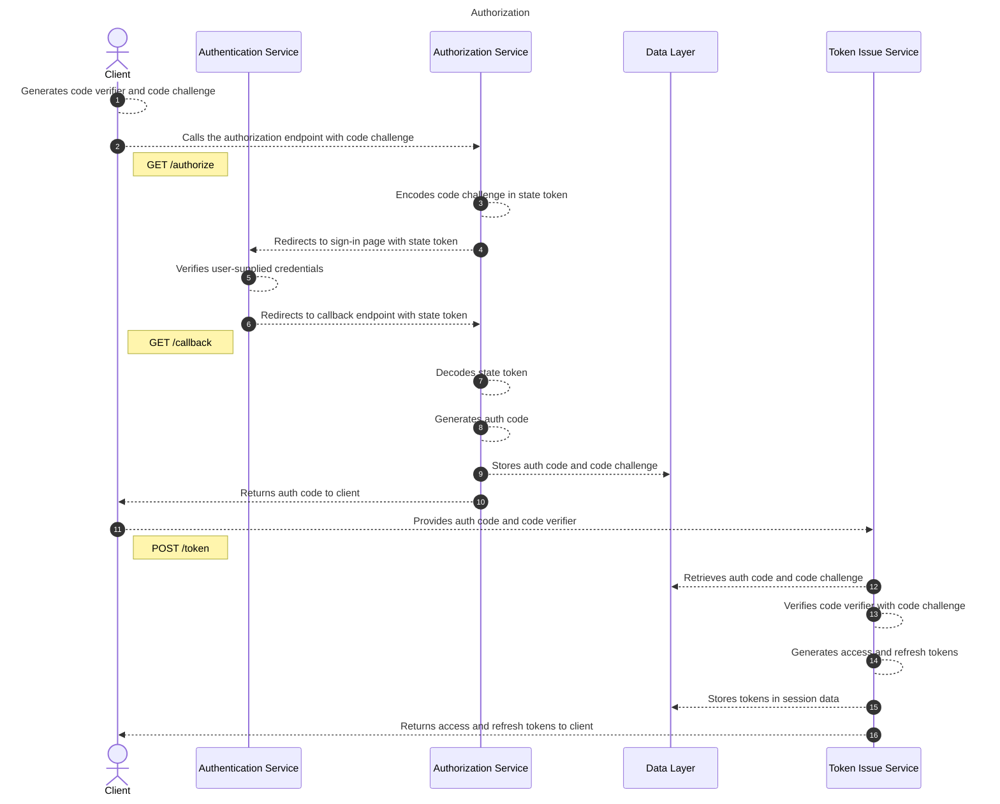
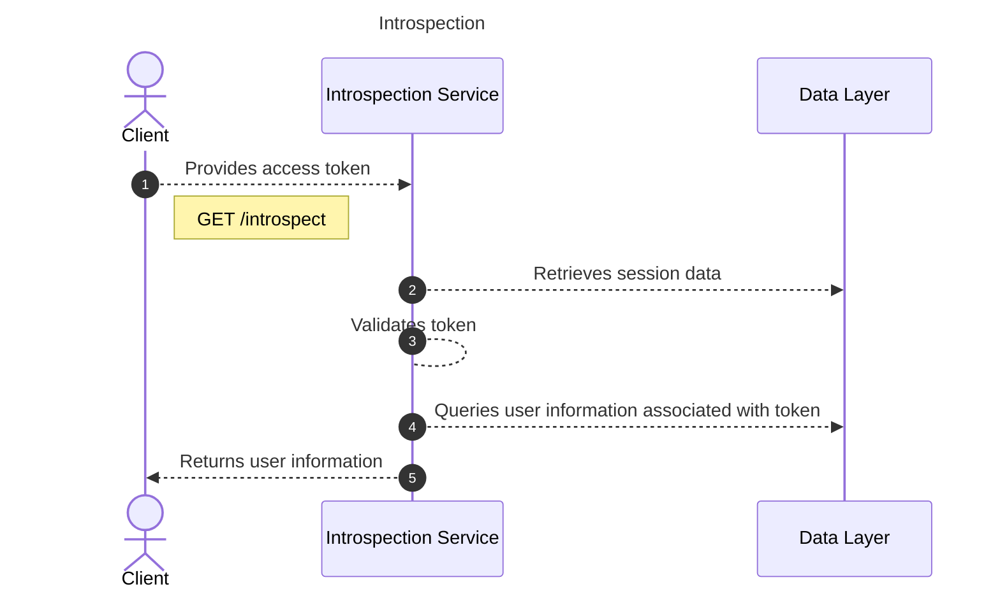
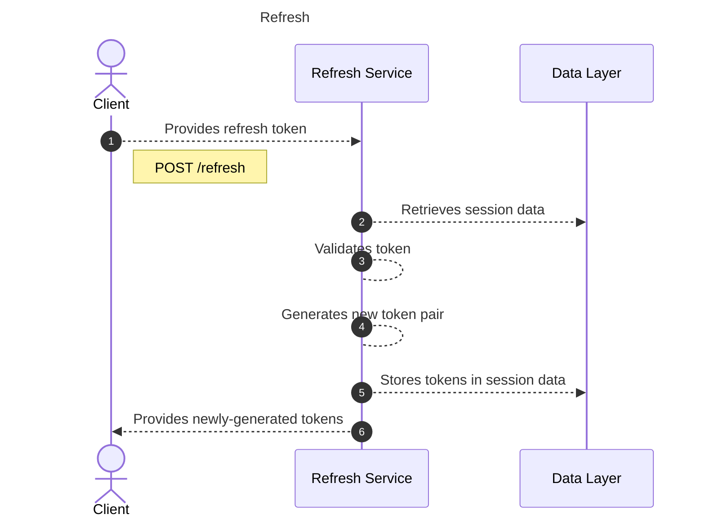
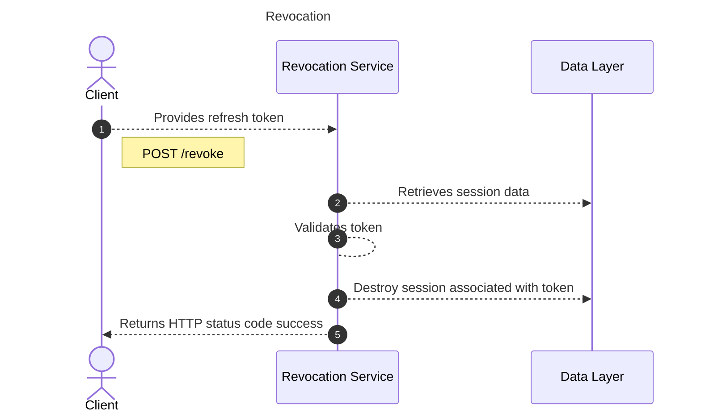

# oauth-flow-demo

## System Design

### Authorization

Authorization is the process a client initiates to retrieve tokens for subsequent interactions with the application.

### Introspection

Introspection is the process a client initiates to retrieve user information associated with a token.

### Refresh

Refresh is the process a client initiates to obtain new tokens for extending a user's access.

### Revocation

Revocation is the process initiated by a client for revoking tokens issued for a given user.

