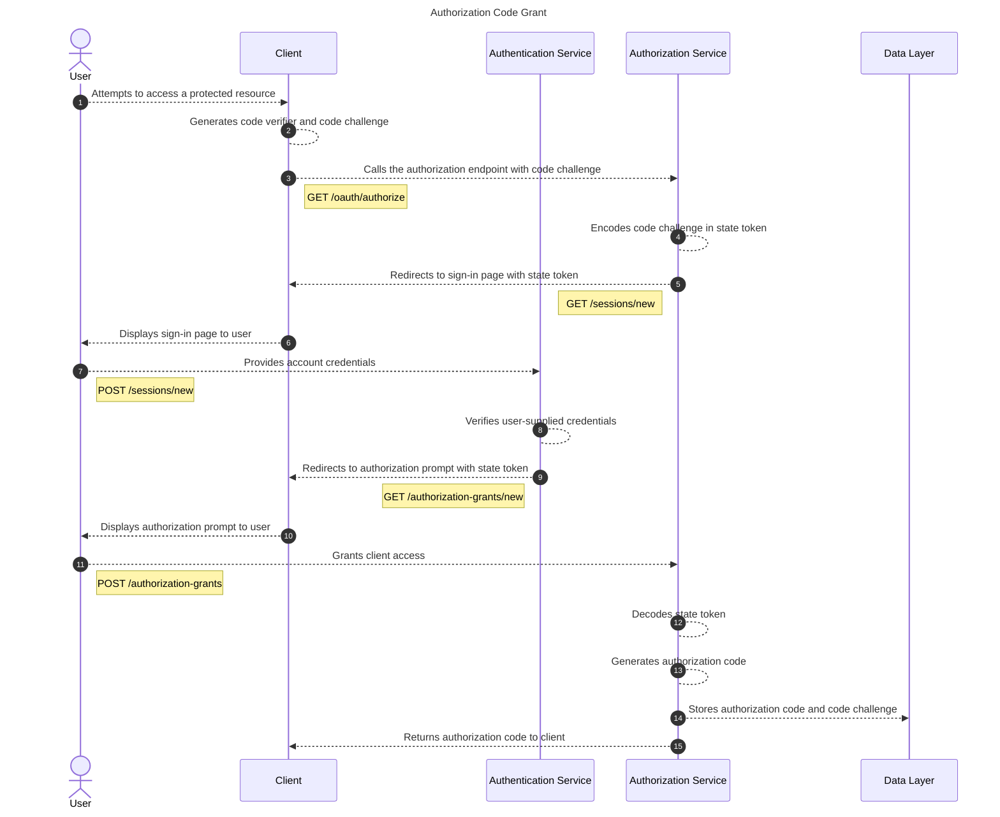

# Authorization Code Grant

Authorization code grant process is the process a client initiates to retrieve an authorization code,
allowing for subsequent interactions with the OAuth provider for OAuth session creation
through the authorization code grant process.

## Process



### User

The User entity represents a user account within the application.

### Client

The Client entity represents a client application registered with the OAuth provider.

### Authentication Service

The Authentication Service entity represents the component of the application which is
responsible for ensuring the user has provided valid credentials and managing cookie
session state.

### Authorization Service

The Authorization Service entity represents the component of the application which is
responsible for managing the initial authorization request and fulfilling it by issuing
an authorization code if approved by the authenticated user.

### Data Layer

The Data Layer entity is a relational database used for storing data related to authorization grants.


## Endpoints

Several endpoints are called by the entities within this flow to complete the task of
authorization. The only endpoints documented here are the endpoints used by the client
during the authorization code grant process.

### GET /oauth/authorize

The client calls the `GET /oauth/authorize` endpoint to initiate the authorization code grant process. This call
redirects to either the Authentication Service to authenticate the user, or directly to the authorization
grant endpoint.

**HTTP Method**: `GET`

**URL**: `/oauth/authorize`

**Params**:

| Param | Required? | Description |
| ----- | --------- | ----------- |
| client_id | yes | The registered client identifier. |
| response_type | yes | The authorization grant type used by the OAuth provider. Must be 'code'. |
| code_challenge | yes | The code challenge derived from the code verifier generated by the client as part of the PKCE scheme. |
| code_challenge_method | yes | The method used to encode the code challenge. |

**Example**:

```
/oauth/authorize?&client_id=democlient&response_type=code&code_challenge=zsjj6ifcll3GtOBMaw38517ZPPHCsD-Wr5GLEDGEIN0&code_challenge_method=S25
```


## References

[RFC-6749: The OAuth 2.0 Authorization Framework](https://www.rfc-editor.org/rfc/rfc6749#section-3.1)

[RFC-7636: Proof Key for Code Exchange by OAuth Public Clients](https://datatracker.ietf.org/doc/html/rfc7636)
